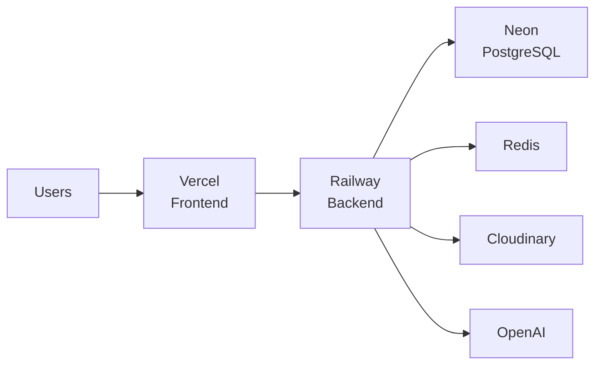

<div align="center">

# SyncSpace

### Enterprise Real-Time Collaboration Platform

A production-grade SaaS application combining documents, kanban boards, messaging, file storage, and AI-powered assistance into one premium platform.

[](LICENSE)
[](https://dotnet.microsoft.com/)
[](https://nextjs.org/)
[](https://www.typescriptlang.org/)
[](#testing)

</div>

---

## Overview

SyncSpace is a full-stack collaboration platform built with modern technologies and Clean Architecture principles. It demonstrates enterprise-grade patterns including CQRS, real-time collaboration via SignalR, RBAC authorization, and a premium UI designed with Apple minimalism aesthetics.

**Key capabilities:**
- **Collaborative Documents** — Rich text editor with real-time cursors, version history, inline comments, and reactions
- **Kanban Boards** — Drag-and-drop cards with labels, assignments, priorities, due dates, and activity tracking
- **Team Chat** — Channel-based messaging with threads, reactions, pinned messages, and direct messages
- **Cloud Drive** — File upload with Cloudinary integration, folder organization, previews, and trash
- **AI Assistant** — GPT-4o powered summarization, meeting notes, rewriting, task extraction, and free chat
- **Admin Panel** — User/workspace management, audit logs, system health, and storage analytics

## Tech Stack

<table>
<tr>
<td>

**Frontend**
- Next.js 15 (App Router)
- React 19
- TypeScript 5.7
- Tailwind CSS 3.4
- Zustand (state)
- Framer Motion (animations)
- React Query (server state)
- SignalR (real-time)

</td>
<td>

**Backend**
- ASP.NET Core 10 (Web API)
- C# 13
- Entity Framework Core 9
- MediatR (CQRS)
- FluentValidation
- SignalR (hubs)
- ASP.NET Identity
- JWT Bearer Auth

</td>
<td>

**Data & Cloud**
- PostgreSQL (Neon)
- Redis (caching)
- Cloudinary (file storage)
- OpenAI GPT-4o (AI)

</td>
</tr>
<tr>
<td>

**DevOps**
- Docker + Compose
- Railway (backend)
- Vercel (frontend)
- GitHub Actions (CI)

</td>
<td>

**Testing**
- xUnit (backend)
- Vitest + React Testing Library (frontend)
- FluentAssertions
- Moq (mocking)

</td>
<td>

**Architecture**
- Clean Architecture
- CQRS + MediatR
- Repository Pattern
- Vertical Slices
- Result Monad

</td>
</tr>
</table>

## Quick Start

```bash
# Clone
git clone https://github.com/your-username/SyncSpace.git
cd SyncSpace

# Backend
cd backend
dotnet restore
dotnet run --project src/SyncSpace.API

# Frontend (new terminal)
cd frontend
npm install
npm run dev
```

Open [http://localhost:3000](http://localhost:3000). See [docs/setup.md](docs/setup.md) for full setup instructions.

## Project Structure

```
SyncSpace/
├── backend/                          .NET 10 Clean Architecture
│   ├── src/
│   │   ├── SyncSpace.API/            Controllers, Hubs, Middleware
│   │   ├── SyncSpace.Application/    CQRS, DTOs, Validators
│   │   ├── SyncSpace.Domain/         Entities, Enums, Interfaces
│   │   ├── SyncSpace.Infrastructure/ Identity, JWT, Redis, Cloudinary, OpenAI
│   │   └── SyncSpace.Persistence/    EF Core, DbContext, Repositories
│   └── tests/                        120 backend tests
├── frontend/                         Next.js 15 App Router
│   └── src/
│       ├── app/                      Pages and layouts
│       ├── components/               Shared UI components
│       ├── features/                 Feature modules (15 domains)
│       ├── lib/                      API clients and utilities
│       └── __tests__/                50 frontend tests
├── docker/                           Docker + Compose configs
└── docs/                             Documentation
```

## Architecture

Built on Clean Architecture with strict inward-only dependencies:

```
API → Infrastructure → Application → Domain
```

Each feature follows the CQRS pattern with MediatR — separate Commands (writes) and Queries (reads), auto-validated through FluentValidation pipeline behaviors. See [docs/architecture.md](docs/architecture.md) for details.

## Features

| Feature | Description | Tech |
|---------|-------------|------|
| **Auth** | Register, login, Google OAuth, JWT refresh tokens | ASP.NET Identity, JWT |
| **Workspaces** | Create workspaces, invite members, RBAC (Owner/Admin/Editor/Viewer) | EF Core, MediatR |
| **Documents** | Rich text editing with real-time collaboration, version history, inline comments | SignalR, CRDT-ready |
| **Boards** | Kanban boards with columns, cards, labels, drag-and-drop, activity log | MediatR, EF Core |
| **Chat** | Channels, threads, reactions, pinned messages, typing indicators | SignalR |
| **Direct Messages** | 1:1 conversations with reactions, read receipts, reply threads | SignalR |
| **Drive** | Cloud file storage with folders, previews, trash, storage stats | Cloudinary |
| **Notifications** | Real-time in-app notifications with filtering and bulk operations | SignalR |
| **Search** | Full-text search across documents, boards, messages, files | PostgreSQL tsvector |
| **Analytics** | Workspace growth, top members, task status, document/message timelines | Raw SQL, Recharts |
| **AI Assistant** | Summarize, meeting notes, rewrite, task extraction, free chat | OpenAI GPT-4o |
| **Admin** | User/workspace/document management, audit logs, system health | Raw SQL |

## Testing

**170 tests** across backend and frontend:

```bash
# Backend — 120 tests (39 domain + 55 application + 26 integration)
cd backend
dotnet test

# Frontend — 50 tests (utils, components, stores)
cd frontend
npm run test
```

| Layer | Tests | Framework | Coverage |
|-------|-------|-----------|----------|
| Domain Unit | 39 | xUnit, FluentAssertions | Entity behavior, enums, computed properties |
| Application Unit | 55 | xUnit, Moq, FluentAssertions | Handlers, validators, ApiResponse |
| Integration | 26 | xUnit, WebApplicationFactory | Full HTTP request/response through controllers |
| Frontend Unit | 50 | Vitest, React Testing Library | Utilities, components, Zustand stores |

## API

129 REST endpoints across 14 controllers + 3 SignalR hubs for real-time features.

| Controller | Endpoints | Auth |
|-----------|-----------|------|
| Auth | 6 | Partial |
| Workspace | 9 | Yes |
| Document | 12 | Yes |
| Board | 26 | Yes |
| Chat | 26 | Yes |
| File | 13 | Yes |
| Notification | 6 | Yes |
| Search | 1 | Yes |
| Analytics | 6 | Yes |
| Audit | 1 | Yes |
| AI | 6 | Yes |
| Admin | 15 | Yes |
| Health | 1 | No |

Full reference: [docs/api.md](docs/api.md)

## Database

31 entities across 9 domain groups, 9 enums, PostgreSQL with EF Core.


Full schema: [docs/database.md](docs/database.md)

## Deployment

| Service | Platform | URL |
|---------|----------|-----|
| Frontend | Vercel | your-app.vercel.app |
| Backend | Railway | your-api.up.railway.app |
| Database | Neon | Serverless PostgreSQL |
| Files | Cloudinary | CDN-backed storage |



See [docs/deployment.md](docs/deployment.md) for the complete deployment guide.

## Documentation

| Document | Description |
|----------|-------------|
| [Setup Guide](docs/setup.md) | Local development environment setup |
| [Architecture](docs/architecture.md) | System design, patterns, and diagrams |
| [Database](docs/database.md) | Entity-relationship diagram and schema |
| [API Reference](docs/api.md) | Complete endpoint documentation |
| [Deployment](docs/deployment.md) | Production deployment guide |
| [Developer Guide](docs/developer-guide.md) | Contributing conventions and patterns |

## License

This project is licensed under the MIT License — see [LICENSE](LICENSE) for details.

---

<div align="center">

**Built with modern technologies and enterprise-grade architecture.**

</div>
