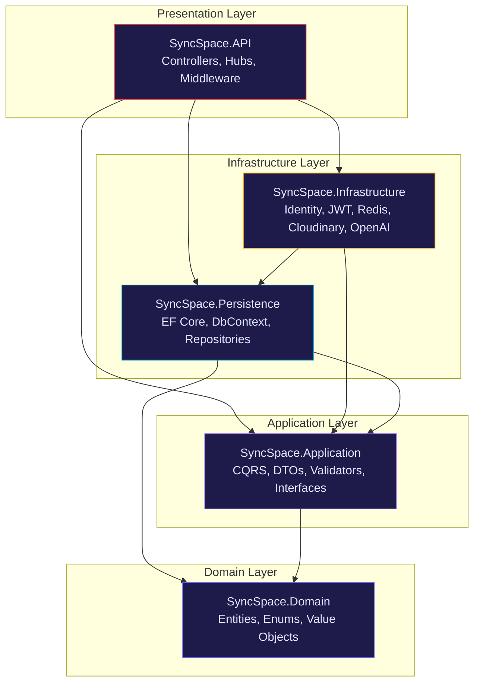
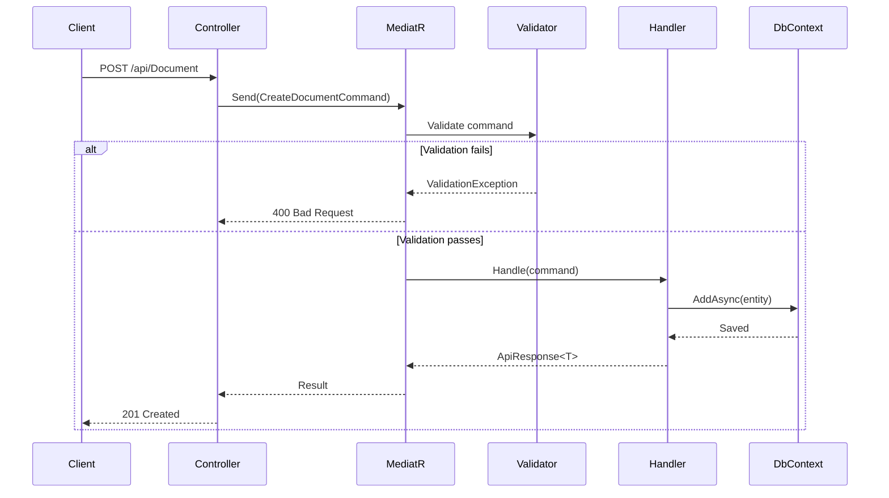
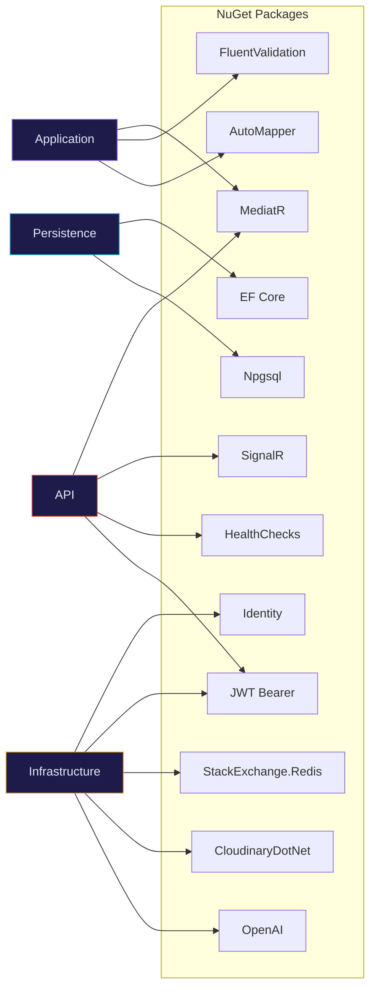
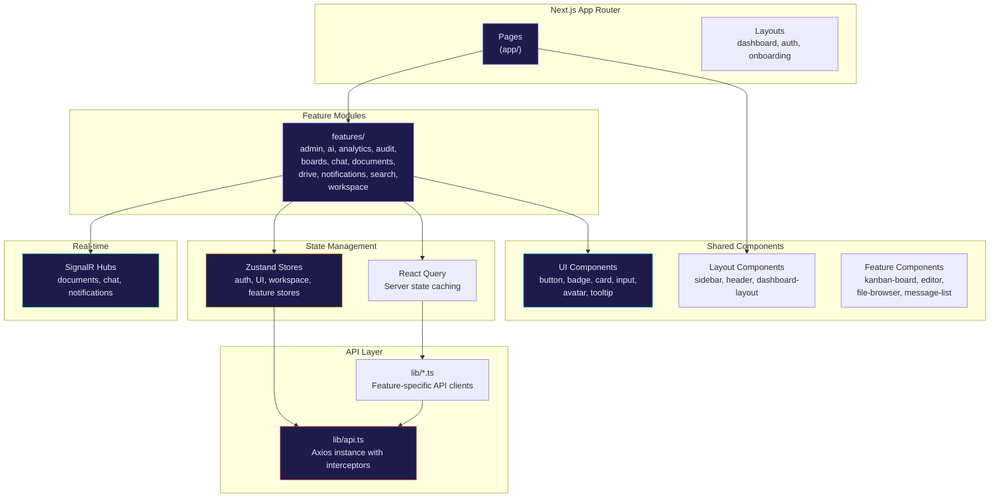
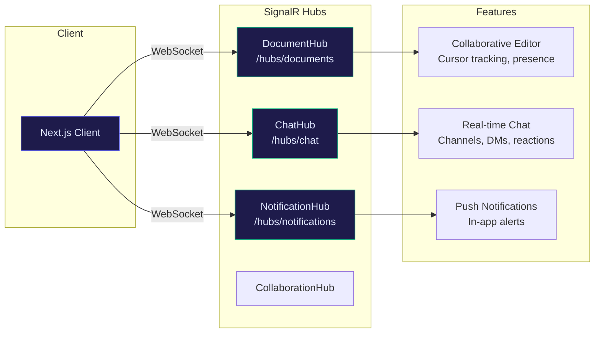
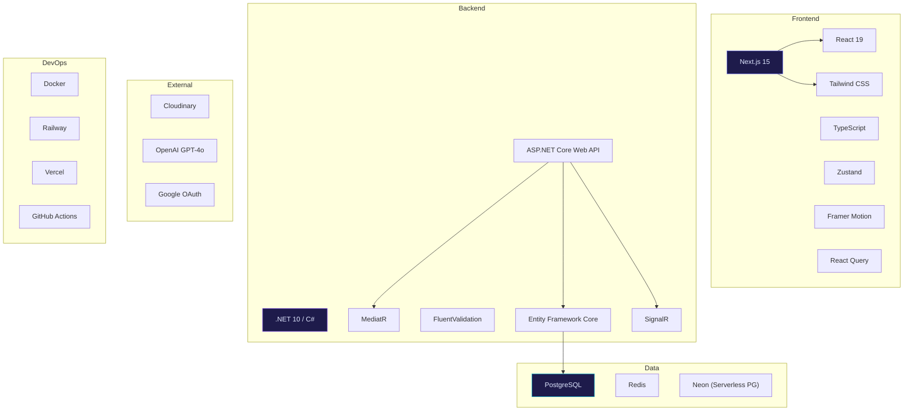

# Architecture

SyncSpace follows Clean Architecture with CQRS, implementing a premium full-stack collaboration platform.

## Clean Architecture

The backend is organized into four concentric layers with strict inward-only dependencies:

### Layer Responsibilities

| Layer | Project | Contains | Depends On |
|-------|---------|----------|------------|
| **Domain** | `SyncSpace.Domain` | Entities, enums, repository interfaces, Result monad | Nothing |
| **Application** | `SyncSpace.Application` | CQRS handlers, DTOs, validators, service interfaces | Domain |
| **Persistence** | `SyncSpace.Persistence` | EF Core DbContext, entity configurations, repository implementations | Domain, Application |
| **Infrastructure** | `SyncSpace.Infrastructure` | Identity, JWT, Redis, Cloudinary, OpenAI, Search, Analytics | Application, Persistence |
| **Presentation** | `SyncSpace.API` | Controllers, SignalR hubs, middleware, authorization | Application, Infrastructure, Persistence |

## CQRS Pattern

Commands and Queries are separated through MediatR, with automatic validation via pipeline behaviors:

### Command Flow (Write Operations)

1. Client sends HTTP request to Controller
2. Controller creates MediatR Command and dispatches it
3. `ValidationBehavior` pipeline runs all FluentValidation validators
4. If valid, the Command Handler executes business logic
5. Handler uses `IUnitOfWork` to persist changes via Repository pattern
6. Returns `ApiResponse<T>` wrapper with success/error state

### Query Flow (Read Operations)

1. Client sends HTTP request to Controller
2. Controller creates MediatR Query and dispatches it
3. Query Handler reads data using `IUnitOfWork.Repository<T>()` or raw SQL
4. Returns `ApiResponse<T>` with mapped DTOs

## Backend Dependency Graph

## Frontend Architecture

### State Management Strategy

| Layer | Tool | Purpose |
|-------|------|---------|
| Server State | React Query (`@tanstack/react-query`) | API data fetching, caching, mutations |
| Client State | Zustand | Auth session, UI state, feature-specific state |
| Form State | react-hook-form + Zod | Form validation and submission |
| URL State | Next.js App Router params/searchParams | Route-based state |

## Real-Time Architecture

## Design Patterns

| Pattern | Where Used | Purpose |
|---------|-----------|---------|
| **Repository** | `IRepository<T>` in Domain, implemented in Persistence | Abstract data access behind generic interface |
| **CQRS** | MediatR commands/queries in Application | Separate read and write models |
| **Decorator** | `CachedSearchService`, `CachedAnalyticsService` | Add Redis caching transparently |
| **Result Monad** | `Result<T>` in Domain | Explicit success/failure without exceptions |
| **Pipeline Behavior** | `ValidationBehavior<,>` | Auto-validate all MediatR requests |
| **Vertical Slices** | Feature-based organization | Each feature is self-contained |
| **Mediator** | MediatR | Decouple controllers from handlers |
| **Factory** | `TestWebApplicationFactory` | Create test server without real dependencies |

## Technology Stack

