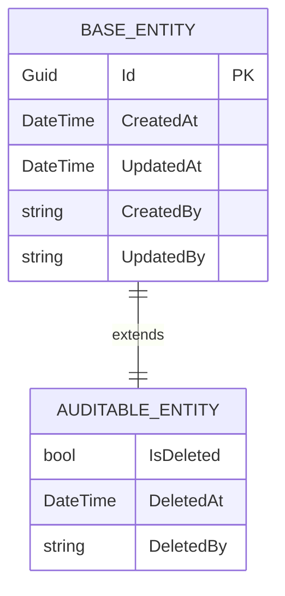

# SyncSpace Database Documentation

## Overview

SyncSpace uses **PostgreSQL** as its primary database. The data model consists of **31 entities** organized into 7 domain groups, supported by **9 enums**, and built on a shared base entity inheritance hierarchy.

---

## Entity Relationship Diagram

```mermaid
erDiagram
    BaseEntity {
        Guid Id PK
        DateTime CreatedAt
        DateTime UpdatedAt
        string CreatedBy
        string UpdatedBy
    }
    AuditableEntity {
        bool IsDeleted
        DateTime DeletedAt
        string DeletedBy
    }

    USER {
        string IdentityId UK
        string Email UK
        string FirstName
        string LastName
        string AvatarUrl
        string Bio
        int Status
    }
    WORKSPACE {
        string Name
        string Slug UK
        string Description
        string IconUrl
        Guid OwnerId FK
        int Plan
    }
    WORKSPACE_MEMBER {
        Guid UserId FK
        Guid WorkspaceId FK
        int Role
    }

    CHANNEL {
        string Name
        string Description
        Guid WorkspaceId FK
        bool IsPrivate
        Guid CreatedById FK
    }
    CHANNEL_MEMBER {
        Guid ChannelId FK
        Guid UserId FK
        int Role
        DateTime LastReadAt
        bool IsMuted
    }
    MESSAGE {
        string Content
        Guid ChannelId FK
        Guid SenderId FK
        Guid ThreadId FK
        int Type
        bool IsEdited
        bool IsPinned
        Guid PinnedById FK
        DateTime PinnedAt
    }
    MESSAGE_READ_RECEIPT {
        Guid MessageId FK
        Guid UserId FK
        DateTime ReadAt
    }
    MESSAGE_EDIT {
        Guid MessageId FK
        string OldContent
        string NewContent
        Guid EditedById FK
    }
    REACTION {
        string Emoji
        Guid MessageId FK
        Guid UserId FK
    }
    ATTACHMENT {
        string Filename
        string Url
        long Size
        string MimeType
        Guid MessageId FK
    }

    CONVERSATION {
        Guid WorkspaceId FK
        Guid User1Id FK
        Guid User2Id FK
        DateTime LastMessageAt
    }
    DIRECT_MESSAGE {
        Guid ConversationId FK
        Guid SenderId FK
        string Content
        bool IsEdited
        Guid ReplyToId FK
    }
    DIRECT_MESSAGE_REACTION {
        Guid MessageId FK
        Guid UserId FK
        string Emoji
    }
    DIRECT_MESSAGE_READ_RECEIPT {
        Guid MessageId FK
        Guid UserId FK
        DateTime ReadAt
    }

    DOCUMENT {
        string Title
        string Content
        Guid WorkspaceId FK
        Guid AuthorId FK
        bool IsPublished
        int Order
        string FolderPath
    }
    DOCUMENT_VERSION {
        Guid DocumentId FK
        string Content
        string Title
        Guid AuthorId FK
        string AuthorName
        int VersionNumber
        string ChangeDescription
    }
    DOCUMENT_COMMENT {
        Guid DocumentId FK
        Guid UserId FK
        string Content
        int PositionStart
        int PositionEnd
        string SelectedText
        bool IsResolved
        Guid ParentCommentId FK
    }
    DOCUMENT_COMMENT_REACTION {
        Guid CommentId FK
        Guid UserId FK
        string Emoji
    }

    BOARD {
        string Name
        string Description
        Guid WorkspaceId FK
        Guid AuthorId FK
    }
    BOARD_COLUMN {
        string Name
        string Color
        Guid BoardId FK
        int Order
    }
    BOARD_CARD {
        string Title
        string Description
        Guid ColumnId FK
        int Order
        Guid AssigneeId FK
        DateTime DueDate
        int Priority
    }
    BOARD_CARD_COMMENT {
        Guid CardId FK
        Guid UserId FK
        string Content
    }
    BOARD_CARD_ATTACHMENT {
        Guid CardId FK
        string Filename
        string Url
        long Size
        string MimeType
        Guid UploadedById FK
    }
    BOARD_ACTIVITY {
        Guid BoardId FK
        Guid CardId FK
        Guid UserId FK
        int ActivityType
        string Description
        string OldValue
        string NewValue
    }
    LABEL {
        string Name
        string Color
        Guid WorkspaceId FK
    }
    CARD_LABEL {
        Guid CardId FK
        Guid LabelId FK
    }

    DRIVE_FILE {
        string OriginalFilename
        string StorageFilename
        string Url
        string ThumbnailUrl
        string MimeType
        long Size
        int FileType
        string FolderPath
        Guid WorkspaceId FK
        Guid UploadedById FK
        bool IsDeleted
        DateTime DeletedAt
        string Description
        string Tags
    }
    DRIVE_FOLDER {
        string Name
        string Path
        string ParentPath
        Guid WorkspaceId FK
        Guid CreatedById FK
    }

    NOTIFICATION {
        int Type
        string Title
        string Message
        Guid UserId FK
        bool IsRead
        string ActionUrl
    }
    REFRESH_TOKEN {
        string Token
        Guid UserId FK
        DateTime Expires
        string CreatedByIp
        DateTime RevokedAt
        string RevokedByIp
        string ReplacedByToken
    }
    AUDIT_LOG {
        Guid UserId FK
        int Action
        string EntityType
        Guid EntityId
        Guid WorkspaceId
        string Description
        string OldValue
        string NewValue
        string IpAddress
        string UserAgent
    }

    BaseEntity ||--|| AuditableEntity : "inherits"

    USER ||--o{ WORKSPACE : "owns"
    USER ||--o{ WORKSPACE_MEMBER : "member_of"
    WORKSPACE ||--o{ WORKSPACE_MEMBER : "has_members"

    USER ||--o{ CHANNEL_MEMBER : "subscribed_to"
    WORKSPACE ||--o{ CHANNEL : "contains"
    CHANNEL ||--o{ CHANNEL_MEMBER : "has_members"

    USER ||--o{ MESSAGE : "sends"
    CHANNEL ||--o{ MESSAGE : "contains"
    MESSAGE ||--o{ MESSAGE : "thread_parent"
    MESSAGE ||--o{ MESSAGE_READ_RECEIPT : "read_by"
    MESSAGE ||--o{ MESSAGE_EDIT : "edit_history"
    MESSAGE ||--o{ REACTION : "has_reactions"
    MESSAGE ||--o{ ATTACHMENT : "has_attachments"

    USER ||--o{ CONVERSATION : "conversant_1"
    USER ||--o{ CONVERSATION : "conversant_2"
    WORKSPACE ||--o{ CONVERSATION : "has_conversations"
    CONVERSATION ||--o{ DIRECT_MESSAGE : "contains"
    DIRECT_MESSAGE ||--o{ DIRECT_MESSAGE_REACTION : "has_reactions"
    DIRECT_MESSAGE ||--o{ DIRECT_MESSAGE_READ_RECEIPT : "read_by"
    DIRECT_MESSAGE ||--o{ DIRECT_MESSAGE : "reply_to"

    USER ||--o{ DOCUMENT : "authors"
    WORKSPACE ||--o{ DOCUMENT : "contains"
    DOCUMENT ||--o{ DOCUMENT_VERSION : "versions"
    DOCUMENT ||--o{ DOCUMENT_COMMENT : "has_comments"
    DOCUMENT_COMMENT ||--o{ DOCUMENT_COMMENT : "reply_to"
    DOCUMENT_COMMENT ||--o{ DOCUMENT_COMMENT_REACTION : "has_reactions"

    USER ||--o{ BOARD : "authors"
    WORKSPACE ||--o{ BOARD : "contains"
    BOARD ||--o{ BOARD_COLUMN : "has_columns"
    BOARD_COLUMN ||--o{ BOARD_CARD : "has_cards"
    BOARD_CARD ||--o{ BOARD_CARD_COMMENT : "has_comments"
    BOARD_CARD ||--o{ BOARD_CARD_ATTACHMENT : "has_attachments"
    BOARD_CARD ||--o{ BOARD_ACTIVITY : "generates"
    BOARD ||--o{ BOARD_ACTIVITY : "tracks"
    WORKSPACE ||--o{ LABEL : "has_labels"
    LABEL ||--o{ CARD_LABEL : "applied_to"
    BOARD_CARD ||--o{ CARD_LABEL : "has_labels"

    USER ||--o{ DRIVE_FILE : "uploads"
    WORKSPACE ||--o{ DRIVE_FILE : "stores"
    USER ||--o{ DRIVE_FOLDER : "creates"
    WORKSPACE ||--o{ DRIVE_FOLDER : "has_folders"

    USER ||--o{ NOTIFICATION : "receives"
    USER ||--o{ REFRESH_TOKEN : "has_tokens"
    USER ||--o{ AUDIT_LOG : "generates"
```

---

## Entity Groups

### 1. Core & Users

| Entity | Key Properties | Relationships |
|--------|---------------|---------------|
| **User** | `IdentityId` (unique), `Email` (unique), `FirstName`, `LastName`, `AvatarUrl?`, `Bio?`, `Status` (UserStatus), `FullName` (computed) | Owner of Workspaces, sender of Messages, member of Channels, author of Documents/Boards |
| **Workspace** | `Name`, `Slug` (unique), `Description?`, `IconUrl?`, `OwnerId` (FK → User, Restrict), `Plan` | Contains Channels, Messages, Documents, Boards, DriveFiles, Labels. Owned by one User. |
| **WorkspaceMember** | `UserId` (FK → User), `WorkspaceId` (FK → Workspace), `Role` (WorkspaceRole). Unique: `(UserId, WorkspaceId)` | Links Users to Workspaces with a role assignment. |

### 2. Channels & Messaging

| Entity | Key Properties | Relationships |
|--------|---------------|---------------|
| **Channel** | `Name`, `Description?`, `WorkspaceId` (FK → Workspace), `IsPrivate`, `CreatedById?` (FK → User, SetNull). Unique: `(WorkspaceId, Name)` | Belongs to Workspace, contains Messages, has ChannelMembers. |
| **ChannelMember** | `ChannelId` (FK → Channel, Cascade), `UserId` (FK → User, Cascade), `Role` (ChannelMemberRole), `LastReadAt`, `IsMuted`. Unique: `(ChannelId, UserId)` | Links Users to Channels with role and read tracking. |
| **Message** | `Content` (text), `ChannelId` (FK → Channel), `SenderId` (FK → User), `ThreadId?` (FK → Message, Restrict), `Type` (MessageType), `IsEdited`, `IsPinned`, `PinnedById?` (FK → User, SetNull), `PinnedAt?` | Sent by User, belongs to Channel, self-referencing thread via `ThreadId`. Has ReadReceipts, Edits, Reactions, Attachments. |
| **MessageReadReceipt** | `MessageId` (FK → Message, Cascade), `UserId` (FK → User, Cascade), `ReadAt`. Unique: `(MessageId, UserId)` | Tracks when a User reads a Message. |
| **MessageEdit** | `MessageId` (FK → Message, Cascade), `OldContent` (text), `NewContent` (text), `EditedById` (FK → User, Restrict) | Stores edit history for Messages. |
| **Reaction** | `Emoji`, `MessageId` (FK → Message, Cascade), `UserId` (FK → User, Cascade). Unique: `(MessageId, UserId, Emoji)` | Emoji reactions on Messages by Users. |
| **Attachment** | `Filename`, `Url`, `Size` (long), `MimeType`, `MessageId` (FK → Message) | File attachments linked to Messages. |

### 3. Direct Messages

| Entity | Key Properties | Relationships |
|--------|---------------|---------------|
| **Conversation** | `WorkspaceId` (FK → Workspace, Cascade), `User1Id` (FK → User, Restrict), `User2Id` (FK → User, Restrict), `LastMessageAt`. Unique: `(User1Id, User2Id)` | 1:1 conversation between two Users within a Workspace. Contains DirectMessages. |
| **DirectMessage** | `ConversationId` (FK → Conversation, Cascade), `SenderId` (FK → User, Restrict), `Content` (text), `IsEdited`, `ReplyToId?` (FK → DirectMessage, SetNull) | Sent by User within a Conversation. Self-referencing reply via `ReplyToId`. Has Reactions and ReadReceipts. |
| **DirectMessageReaction** | `MessageId` (FK → DirectMessage, Cascade), `UserId` (FK → User, Cascade), `Emoji`. Unique: `(MessageId, UserId, Emoji)` | Emoji reactions on DirectMessages. |
| **DirectMessageReadReceipt** | `MessageId` (FK → DirectMessage, Cascade), `UserId` (FK → User, Cascade), `ReadAt`. Unique: `(MessageId, UserId)` | Tracks when a User reads a DirectMessage. |

### 4. Documents

| Entity | Key Properties | Relationships |
|--------|---------------|---------------|
| **Document** | `Title`, `Content` (text), `WorkspaceId` (FK → Workspace), `AuthorId` (FK → User), `IsPublished`, `Order`, `FolderPath?` | Authored by User, belongs to Workspace. Has Versions, Comments. AuditableEntity (soft delete). |
| **DocumentVersion** | `DocumentId` (FK → Document, Cascade), `Content` (text), `Title?`, `AuthorId?`, `AuthorName?`, `VersionNumber`, `ChangeDescription?`. Unique: `(DocumentId, VersionNumber)` | Versioned snapshots of a Document's content. |
| **DocumentComment** | `DocumentId` (FK → Document, Cascade), `UserId` (FK → User, Restrict), `Content` (text), `PositionStart?`, `PositionEnd?`, `SelectedText?`, `IsResolved`, `ParentCommentId?` (FK → DocumentComment, Restrict) | Threaded comments on Documents with positional anchoring. Self-referencing reply via `ParentCommentId`. |
| **DocumentCommentReaction** | `CommentId` (FK → DocumentComment, Cascade), `UserId` (FK → User, Restrict), `Emoji`. Unique: `(CommentId, UserId, Emoji)` | Emoji reactions on DocumentComments. |

### 5. Boards (Kanban)

| Entity | Key Properties | Relationships |
|--------|---------------|---------------|
| **Board** | `Name`, `Description?`, `WorkspaceId` (FK → Workspace), `AuthorId` (FK → User) | Authored by User, belongs to Workspace. Has Columns, tracks Activity. |
| **BoardColumn** | `Name`, `Color?`, `BoardId` (FK → Board), `Order` | Ordered columns within a Board. Contains Cards. |
| **BoardCard** | `Title`, `Description?` (text), `ColumnId` (FK → BoardColumn), `Order`, `AssigneeId?` (FK → User, SetNull), `DueDate?`, `Priority` (CardPriority) | Ordered cards within a Column. May be assigned to a User. Has Comments, Attachments, Activity, Labels. |
| **BoardCardComment** | `CardId` (FK → BoardCard, Cascade), `UserId` (FK → User, Restrict), `Content` (text) | Comments on BoardCards. |
| **BoardCardAttachment** | `CardId` (FK → BoardCard, Cascade), `Filename`, `Url`, `Size` (long), `MimeType`, `UploadedById` (FK → User, Restrict) | File attachments on BoardCards. |
| **BoardActivity** | `BoardId` (FK → Board, Cascade), `CardId?` (FK → BoardCard, SetNull), `UserId` (FK → User, Restrict), `ActivityType` (ActivityType), `Description`, `OldValue?`, `NewValue?` | Activity log for Boards and Cards. |
| **Label** | `Name`, `Color` (default `"#6366F1"`), `WorkspaceId` (FK → Workspace, Cascade) | Workspace-scoped labels for tagging Cards. |
| **CardLabel** | `CardId` (FK → BoardCard, Cascade), `LabelId` (FK → Label, Cascade). Unique: `(CardId, LabelId)` | Many-to-many join between BoardCards and Labels. |

### 6. Drive & Files

| Entity | Key Properties | Relationships |
|--------|---------------|---------------|
| **DriveFile** | `OriginalFilename`, `StorageFilename`, `Url`, `ThumbnailUrl?`, `MimeType`, `Size` (long), `FileType` (FileType), `FolderPath?` (default `"/"`), `WorkspaceId` (FK → Workspace, Cascade), `UploadedById` (FK → User, Restrict), `IsDeleted`, `DeletedAt?`, `Description?`, `Tags?` | Uploaded by User, belongs to Workspace. Supports soft delete and metadata. |
| **DriveFolder** | `Name`, `Path` (default `"/"`), `ParentPath?`, `WorkspaceId` (FK → Workspace, Cascade), `CreatedById` (FK → User, Restrict). Unique: `(WorkspaceId, Path)` | Hierarchical folder structure within a Workspace. |

### 7. System

| Entity | Key Properties | Relationships |
|--------|---------------|---------------|
| **Notification** | `Type` (NotificationType), `Title`, `Message`, `UserId` (FK → User), `IsRead`, `ActionUrl?` | Sent to a User. Indexed on `(UserId, IsRead)` for efficient unread queries. |
| **RefreshToken** | `Token`, `UserId` (FK → User), `Expires`, `CreatedByIp?`, `RevokedAt?`, `RevokedByIp?`, `ReplacedByToken?`, `IsExpired` (computed), `IsActive` (computed) | JWT refresh tokens for User sessions. Supports revocation and token rotation. |
| **AuditLog** | `UserId` (FK → User, Restrict), `Action` (AuditAction), `EntityType`, `EntityId?`, `WorkspaceId?`, `Description`, `OldValue?`, `NewValue?`, `IpAddress?`, `UserAgent?` | Immutable audit trail of all significant actions across the system. |

---

## Enums Reference

| Enum | Values |
|------|--------|
| **UserStatus** | `Active` (0), `Inactive` (1), `Suspended` (2) |
| **WorkspaceRole** | `Owner` (0), `Admin` (1), `Editor` (2), `Viewer` (3) |
| **ChannelMemberRole** | `Member` (0), `Admin` (1) |
| **MessageType** | `Text` (0), `File` (1), `System` (2) |
| **NotificationType** | `Mention` (0), `Assignment` (1), `Comment` (2), `Update` (3), `Invite` (4) |
| **CardPriority** | `None` (0), `Low` (1), `Medium` (2), `High` (3), `Urgent` (4) |
| **ActivityType** | `Created` (0), `Updated` (1), `Deleted` (2), `Moved` (3), `Assigned` (4), `Unassigned` (5), `Commented` (6), `AttachmentAdded` (7), `AttachmentRemoved` (8), `LabelAdded` (9), `LabelRemoved` (10), `PriorityChanged` (11), `DueDateChanged` (12) |
| **AuditAction** | `UserLogin` (0), `UserLogout` (1), `UserCreated` (2), `UserUpdated` (3), `WorkspaceCreated` (4), `WorkspaceUpdated` (5), `WorkspaceDeleted` (6), `ChannelCreated` (7), `ChannelUpdated` (8), `ChannelDeleted` (9), `MessageSent` (10), `MessageDeleted` (11), `DocumentCreated` (12), `DocumentUpdated` (13), `DocumentDeleted` (14), `BoardCreated` (15), `BoardUpdated` (16), `BoardDeleted` (17), `WorkspaceMemberAdded` (18), `WorkspaceUpdated` (19) |
| **FileType** | `Image` (0), `Pdf` (1), `Document` (2), `Spreadsheet` (3), `Presentation` (4), `Video` (5), `Audio` (6), `Archive` (7), `Other` (8) |

---

## Unique Indexes

| Table | Columns | Constraint |
|-------|---------|------------|
| **User** | `IdentityId` | Unique |
| **User** | `Email` | Unique |
| **Workspace** | `Slug` | Unique |
| **WorkspaceMember** | `UserId`, `WorkspaceId` | Composite Unique |
| **Channel** | `WorkspaceId`, `Name` | Composite Unique |
| **ChannelMember** | `ChannelId`, `UserId` | Composite Unique |
| **MessageReadReceipt** | `MessageId`, `UserId` | Composite Unique |
| **Reaction** | `MessageId`, `UserId`, `Emoji` | Composite Unique |
| **Conversation** | `User1Id`, `User2Id` | Composite Unique |
| **DirectMessageReaction** | `MessageId`, `UserId`, `Emoji` | Composite Unique |
| **DirectMessageReadReceipt** | `MessageId`, `UserId` | Composite Unique |
| **DocumentVersion** | `DocumentId`, `VersionNumber` | Composite Unique |
| **DocumentCommentReaction** | `CommentId`, `UserId`, `Emoji` | Composite Unique |
| **CardLabel** | `CardId`, `LabelId` | Composite Unique |
| **DriveFolder** | `WorkspaceId`, `Path` | Composite Unique |

### Composite Indexes

| Table | Columns | Type |
|-------|---------|------|
| **Notification** | `UserId`, `IsRead` | Composite Index (non-unique) |

---

## Base Entity Inheritance

### Inheritance Summary

All entities inherit from **BaseEntity**, which provides:

| Property | Type | Description |
|----------|------|-------------|
| `Id` | `Guid` | Primary key, auto-generated |
| `CreatedAt` | `DateTime` | Timestamp of creation |
| `UpdatedAt` | `DateTime` | Timestamp of last update |
| `CreatedBy` | `string?` | Identity of the creator |
| `UpdatedBy` | `string?` | Identity of the last updater |

**AuditableEntity** extends BaseEntity and adds soft-delete support:

| Property | Type | Description |
|----------|------|-------------|
| `IsDeleted` | `bool` | Soft-delete flag |
| `DeletedAt` | `DateTime?` | Timestamp of deletion |
| `DeletedBy` | `string?` | Identity of the deleter |

### Entities Using AuditableEntity

- **Workspace**
- **Channel**
- **Document**

All other 28 entities inherit directly from **BaseEntity**.
